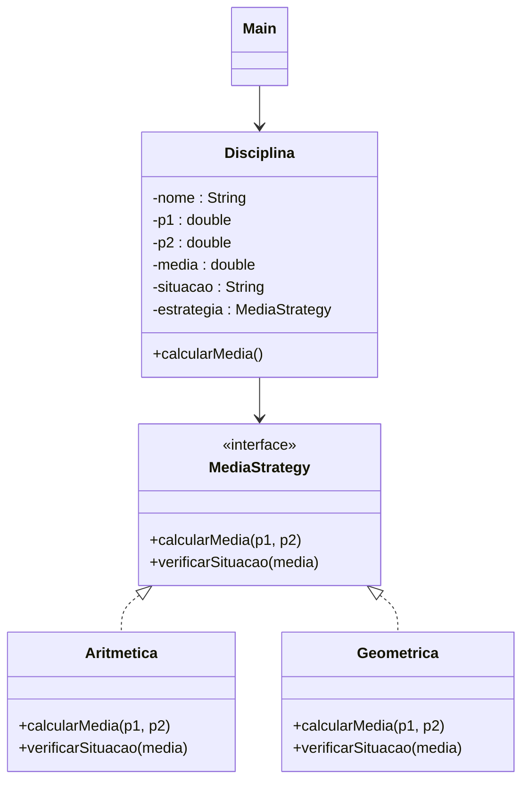

# Atividade Prática — Design Pattern **Strategy**
---

## 1. Objetivos da Atividade

* Compreender o _design pattern_ **Strategy** e suas vantagens.  
* Projetar **interfaces** e classes concretas que encapsulam diferentes **estratégias de cálculo de média**.  
* Aplicar o princípio **Open/Closed** (aberto para extensão, fechado para modificação).  
* Consolidar boas práticas de programação orientada a objetos em **Java**.

---

## 2. Contexto do Problema

O coordenador do curso deseja unificar a forma de calcular a média final das disciplinas, mas **diferentes métodos** podem ser adotados conforme a ementa:

* **Média aritmética** – aprovado se `média ≥ 5,0`
* **Média geométrica** – aprovado se `média ≥ 7,0`

Você deve **isolar** esses comportamentos em classes independentes e permitir que a disciplina escolha a estratégia em tempo de execução.

---

## 3. Requisitos Funcionais

1. A aplicação **deve** ser executada em modo console.  
2. **Interfaces** devem ser usadas para definir o contrato das estratégias.  
3. O programa **não** deve conter regras “_se/então_” (`if`) para decidir qual fórmula aplicar; a decisão ocorre via **injeção da estratégia**.  
4. A saída deve exibir: `P1`, `P2`, `Média` e `Situação (Aprovado/Reprovado)` conforme exemplo.  

---

## 4. Passo a Passo de Implementação

| Passo | Descrição |
|-------|-----------|
| **1** | Crie a **interface** `MediaStrategy` com dois métodos:<br>`double calcularMedia(double p1, double p2);`<br>`String verificarSituacao(double media);` |
| **2** | Implemente a classe **concreta** `Aritmetica` que realiza:<br>`média = (p1 + p2) / 2` e aprova se `média ≥ 5.0`. |
| **3** | Implemente a classe **concreta** `Geometrica` que realiza:<br>`média = √(p1 × p2)` e aprova se `média ≥ 7.0`. |
| **4** | Crie a classe `Disciplina` contendo nome, notas (`p1`, `p2`), média e situação. Ela recebe um objeto `MediaStrategy` no construtor. |
| **5** | Desenvolva a classe `Main` (método `main`) demonstrando o uso das duas estratégias (comente/descomente para trocar). |
| **6** | Compile com `javac` e execute com `java Main`. |

### 4.1 Exemplo de Código

```java
public class Main {
    public static void main(String[] args) {
        MediaStrategy estrategia = new Aritmetica();      // troque por new Geometrica()
        Disciplina d = new Disciplina(estrategia);

        d.setNome("Padrões de Desenvolvimento");
        d.setP1(10);
        d.setP2(5);
        d.calcularMedia();

        System.out.printf("P1: %.2f  P2: %.2f  Média: %.2f  Situação: %s%n",
                d.getP1(), d.getP2(), d.getMedia(), d.getSituacao());
    }
}
```

---

## 5. Diagrama de Classes



---

## 6. Orientações para Entrega

1. **Crie** um repositório **público** no GitHub para armezar a resposta a esta tarefa.  
2. **Faça commit** de todo o código‑fonte (`src/`).  
3. Verifique se o projeto compila e executa (IDE sugerido InteliJ).  
4. Envie o **link** do repositório na plataforma de entrega da disciplina.

---

## 7. Dicas Úteis

* Lembre‑se de usar o modificador `@Override` para métodos implementados a partir da interface.  
* Teste cada estratégia separadamente trocando a instância no `Main`.  
* Evite condicionais duplicando a lógica; deixe a **variação** confinada às classes de estratégia.  


